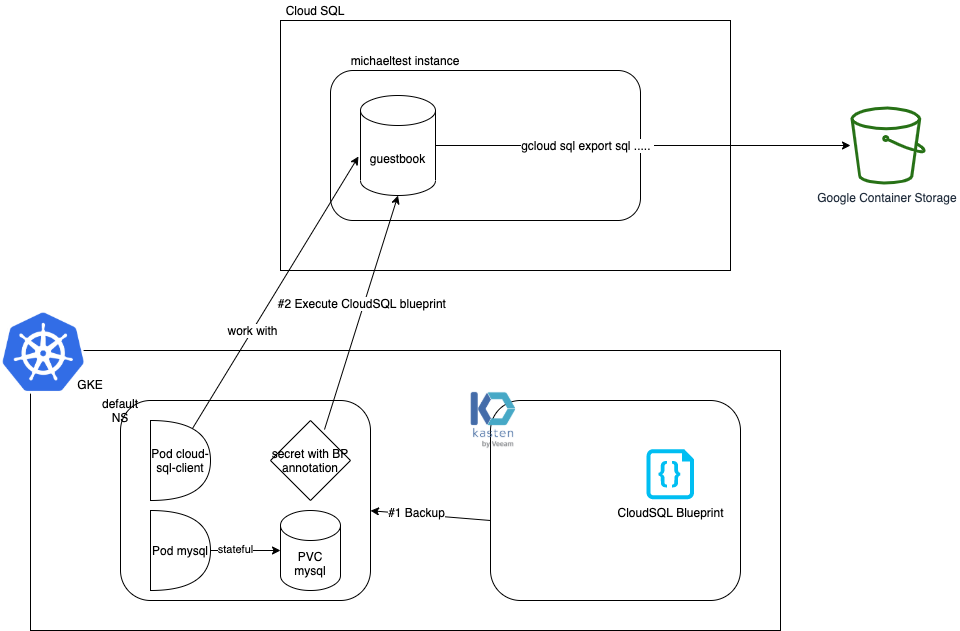

# Goal

We demonstrate how to use blueprint to include your cloudsql instance in your kasten backup. 



We're going to define different term that we'll reuse through this document : 
*  <PROJECT> : the name of the google cloud you're working on for instance `rich-access-174020` 
*  GSA : Google service account 
*  KSA : Kubernetes Service account 
*  <GSA_KASTEN> : the Google Service Account used by Kasten for instance `michael-sa@rich-access-174020.iam.gserviceaccount.com`
*  <GSA_PSQL_CLIENT> : the Google Service Account used by the cloud-sql-client pod for instance  `psql-client@rich-access-174020.iam.gserviceaccount.com`
*  <KSA_PSQL_CLIENT> : the KSA Service Account used by the cloud-sql-client pod for instance  `psql-client`
*  <GSA_CLOUDSQL_INSTANCE> : the Google Service Account used by the cloudsql instance for instance `p215900857647-4pv8oo@gcp-sa-cloud-sql.iam.gserviceaccount.com`
*  <CLOUDSQL_INSTANCE> : the name of the Cloud SQL instance for instance `michaeltest`
*  <DATABASE> : the name of the database we want to save in the cloud sql instance for instance `guestbook` 
*  <GOOGLE_STORAGE_BUCKET> : the name of the google storage bucket where you'll send the database export for instance `michael-bucket`
*  <CLUSTER_NAME> : the name of the cluster that we create for instance `michael-cloudsqltest` 

# Create a postgres instance and a bucket 

Follow this guide to create a [postgres cloudsql instance](https://cloud.google.com/sql/docs/postgres/quickstart), in the following we'll call this instance <CLOUDSQL_INSTANCE>.

Follow this guide to create a [google storage bucket](https://cloud.google.com/storage/docs/creating-buckets#storage-create-bucket-console), in the following we'll call this bucket `<GOOGLE_STORAGE_BUCKET>`. 

Make sure the <GSA_CLOUDSQL_INSTANCE> is able to write to the bucket.

```
gsutil iam ch serviceAccount:<GSA_CLOUDSQL_INSTANCE>:roles/storage.objectAdmin gs://<GOOGLE_STORAGE_BUCKET>
```

# Create the kubernetes cluster 

Notice the scope sqlservice.admin, it's necessary to allow a pod to perform cloud sql admin task.

```
gcloud container clusters create <CLUSTER_NAME> \
    --zone us-central1-f \
    --node-locations us-central1-f,us-central1-a,us-central1-b \
    --num-nodes=1 \
    --scopes "https://www.googleapis.com/auth/devstorage.read_only","https://www.googleapis.com/auth/logging.write","https://www.googleapis.com/auth/monitoring","https://www.googleapis.com/auth/servicecontrol","https://www.googleapis.com/auth/service.management.readonly","https://www.googleapis.com/auth/trace.append","https://www.googleapis.com/auth/sqlservice.admin"

gcloud container clusters get-credentials <CLUSTER_NAME> --zone=us-central1-c
```

# Create a pod that connect to the cloud sql instance 

We'll follow [this guide](https://cloud.google.com/sql/docs/postgres/connect-kubernetes-engine).


## Set up workload identity 

Create a GSA with roles/cloudsql.client

```
gcloud iam service-accounts create <KSA_PSQL_CLIENT>

gcloud projects add-iam-policy-binding <PROJECT> --member serviceAccount:<GSA_PSQL_CLIENT> --role roles/cloudsql.client
```

Create a KSA 

```
cat <<EOF |kubectl create -f -
apiVersion: v1
kind: ServiceAccount
metadata:
  name: <KSA_PSQL_CLIENT>
EOF
```

link KSA and GSA 

```
gcloud iam service-accounts add-iam-policy-binding \
--role="roles/iam.workloadIdentityUser" \
--member="serviceAccount:<PROJECT>.svc.id.goog[default/<KSA_PSQL_CLIENT>]" \
<GSA_PSQL_CLIENT>

kubectl annotate serviceaccount \
<KSA_PSQL_CLIENT> \
iam.gke.io/gcp-service-account=<GSA_PSQL_CLIENT>
```

## create a deployment to this instance plus a regular stateful workload

```
kubectl create -f cloudsql-client.yaml
```

Connect to the psql-client container and create the database <DATABASE>.

```
kubectl exec -it deploy/cloud-sql-client -c psql-client -- bash
psql -h 127.0.0.1 -U postgres
postgres=> \l
                                                List of databases
     Name      |       Owner       | Encoding |  Collate   |   Ctype    |            Access privileges            
---------------+-------------------+----------+------------+------------+-----------------------------------------
 cloudsqladmin | cloudsqladmin     | UTF8     | en_US.UTF8 | en_US.UTF8 | 
 postgres      | cloudsqlsuperuser | UTF8     | en_US.UTF8 | en_US.UTF8 | 
 template0     | cloudsqladmin     | UTF8     | en_US.UTF8 | en_US.UTF8 | =c/cloudsqladmin                       +
               |                   |          |            |            | cloudsqladmin=CTc/cloudsqladmin
 template1     | cloudsqlsuperuser | UTF8     | en_US.UTF8 | en_US.UTF8 | =c/cloudsqlsuperuser                   +
               |                   |          |            |            | cloudsqlsuperuser=CTc/cloudsqlsuperuser
postgres=> create database <DATABASE>;
postgres=> \c <DATABASE>
psql (13.4 (Debian 13.4-1.pgdg100+1), server 13.3)
You are now connected to database "<DATABASE>" as user "postgres".

<DATABASE>=> CREATE TABLE entries (guestName VARCHAR(255), content VARCHAR(255),
                        entryID SERIAL PRIMARY KEY);
<DATABASE>=> INSERT INTO entries (guestName, content) values ('first guest', 'I got here!');
<DATABASE>=> INSERT INTO entries (guestName, content) values ('second guest', 'Me too!');
<DATABASE>=> INSERT INTO entries (guestName, content) values ('Third guest', 'I love it !!');
INSERT 0 1
<DATABASE>=> \q
```

## Create a mysql server in the same namespace

```
kubectl create -f mysql.yaml
kubectl exec -ti sts/mysql -- bash

mysql --user=root --password=ultrasecurepassword
CREATE DATABASE test;
USE test;
CREATE TABLE pets (name VARCHAR(20), owner VARCHAR(20), species VARCHAR(20), sex CHAR(1), birth DATE, death DATE);
INSERT INTO pets VALUES ('Puffball','Diane','hamster','f','1999-03-30',NULL);
SELECT * FROM pets;
+----------+-------+---------+------+------------+-------+
| name     | owner | species | sex  | birth      | death |
+----------+-------+---------+------+------------+-------+
| Puffball | Diane | hamster | f    | 1999-03-30 | NULL  |
+----------+-------+---------+------+------------+-------+
1 row in set (0.00 sec)
```

# install Kasten 

Now in the default namespace we have a cloudsql client pod and a mysql server pod with a pvc. We want to backup all this elements in sync with the database in the cloud sql instance.

Make sure that <GSA_KASTEN> has roles/compute.storageAdmin to backup the google disk pvc. 

```
gcloud projects add-iam-policy-binding <PROJECT> --member serviceAccount:<GSA_KASTEN> --role roles/compute.storageAdmin
```

Create the key file
```
gcloud iam service-accounts keys create --iam-account=<GSA_KASTEN> k10-sa-key.json
```

Install K10.
```
sa_key=$(base64 k10-sa-key.json)
kubectl create ns kasten-io
helm install k10 kasten/k10 --namespace=kasten-io --set secrets.googleApiKey=$sa_key
```

This will create a secret google-secret which hold the GSA key, the blueprint will use this secret.

# Set up blueprint 

```
kubectl create -f cloudsql-bp.yaml
```

# Create and annotate a secret to backup the database 

The secret will provide information on the instance and the database we want to backup. 

The annotation will inform Kasten to trigger the blueprint.

```
kubectl create secret generic <CLOUDSQL_INSTANCE>-<DATABASE> \
 --from-literal=instance=<CLOUDSQL_INSTANCE> \
 --from-literal=database=<DATABASE> \
 --from-literal=bucket=<GOOGLE_STORAGE_BUCKET> \
 --namespace=default
kubectl annotate secret -n default <CLOUDSQL_INSTANCE>-<DATABASE> kanister.kasten.io/blueprint='cloudsql-bp'
```


# Test backup

Create a policy with an export to the bucket and run it. 

You should see an sql export in gz format in `gs://$bucket/k10/${clusterID}/cloudsql/${namespace}/${instance}/${database}_${dumpdate}.gz`.

# Test recovery 

## Emulate a disaster. 

Delete the resource in the namespace
```
kubectl delete deploy,sts,pvc,secret --all
```

Delete and recreate the database <DATABASE>
```
gcloud sql connect <CLOUDSQL_INSTANCE> --user=postgres
Allowlisting your IP for incoming connection for 5 minutes...done.                                                                                                
Connecting to database with SQL user [postgres].Password: 
psql (13.4, server 13.3)
SSL connection (protocol: TLSv1.3, cipher: TLS_AES_256_GCM_SHA384, bits: 256, compression: off)
Type "help" for help.

postgres=> drop database <DATABASE>;
DROP DATABASE
postgres=> create database <DATABASE>;
CREATE DATABASE
postgres=> \q
```

## Recover from the restore point 

Find your last exported restorepoint and click restore.

When it's finished check your data are all back.

Check the sql instance :
```
kubectl exec -it deploy/cloud-sql-client -c psql-client -- bash
root@cloud-sql-client-5f8546d884-v867n:/# psql -h 127.0.0.1 -U postgres
Password for user postgres: 
psql (13.4 (Debian 13.4-1.pgdg110+1), server 13.3)
Type "help" for help.

postgres=> \c <DATABASE>
psql (13.4 (Debian 13.4-1.pgdg110+1), server 13.3)
You are now connected to database "<DATABASE>" as user "postgres".
<DATABASE>=> select * from entries;
  guestname   |   content    | entryid 
--------------+--------------+---------
 first guest  | I got here!  |       1
 second guest | Me too!      |       2
 Third guest  | I love it !! |       3
(3 rows)

<DATABASE>=> \q
root@cloud-sql-client-5f8546d884-v867n:/# exit
exit
```

Check the mysql pod 
```
kubectl exec -ti sts/mysql -- bash
root@mysql-0:/# mysql --user=root --password=ultrasecurepassword
mysql: [Warning] Using a password on the command line interface can be insecure.
Welcome to the MySQL monitor.  Commands end with ; or \g.
Your MySQL connection id is 8
Server version: 8.0.26 MySQL Community Server - GPL

Copyright (c) 2000, 2021, Oracle and/or its affiliates.

Oracle is a registered trademark of Oracle Corporation and/or its
affiliates. Other names may be trademarks of their respective
owners.

Type 'help;' or '\h' for help. Type '\c' to clear the current input statement.

mysql> use test 
Reading table information for completion of table and column names
You can turn off this feature to get a quicker startup with -A

Database changed
mysql> select * from pets;
+----------+-------+---------+------+------------+-------+
| name     | owner | species | sex  | birth      | death |
+----------+-------+---------+------+------------+-------+
| Puffball | Diane | hamster | f    | 1999-03-30 | NULL  |
+----------+-------+---------+------+------------+-------+
1 row in set (0.00 sec)
```

# To debug 

To check what's going on the kansiter pod when backup or restore are running you can run this command.

```
while true; do kubectl logs -f -n kasten-io -l createdBy=kanister; sleep 2; done
```